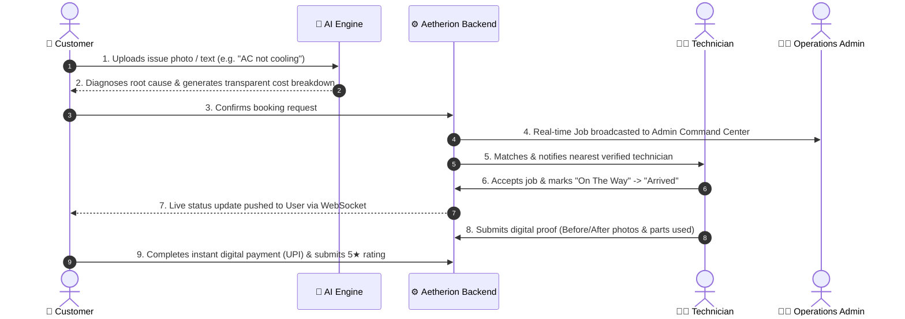

# ⬡ AETHERION / ServoLocal
> **AI-Powered On-Demand Appliance & Home Repair Platform**  
> *Next-Generation Hyper-Local Service Dispatch, Multi-Modal AI Diagnostics, & Real-Time Digital Handover.*

---

## 🌟 Executive Summary

**Aetherion** (also referred to as *ServoLocal*) solves one of the largest unorganized markets in urban services: **unreliable, non-transparent, and slow home appliance repair**. 

By combining **Computer Vision AI diagnostics**, **dynamic transparent pricing**, **intelligent proximity-based technician dispatch**, and **real-time bi-directional WebSocket syncing**, Aetherion bridges the trust and efficiency gap between consumers, field technicians, and platform operators.

---

## 🏗️ Architecture Overview

The project is structured into three clean, decoupled layers designed for rapid demonstration today and seamless production scaling tomorrow:

```
                      ┌────────────────────────────────────────┐
                      │        AETHERION PRESENTATION HUB      │
                      │  (3-in-1 Live Synchronized Multi-View) │
                      └───────┬──────────────┬──────────┬──────┘
                              │              │          │
                     ┌────────▼───────┐ ┌────▼───────┐ ┌▼───────────────┐
                     │   User View    │ │ Tech View  │ │ Admin Dashboard│
                     │ (Web / Mobile) │ │  (Mobile)  │ │   (Desktop)    │
                     └────────┬───────┘ └────┬───────┘ └┬───────────────┘
                              │              │          │
                              └───────┬──────┴──────────┘
                                      │ HTTP REST & WebSocket (Real-time)
                                      ▼
                      ┌────────────────────────────────────────┐
                      │         FASTAPI BACKEND ENGINE         │
                      │  • AI Multi-Modal Diagnostic Engine    │
                      │  • Proximity Smart Matchmaking Engine  │
                      │  • Dynamic Transparent Pricing Engine  │
                      │  • Real-time WebSocket Event Bus       │
                      │  • SQLite / PostgreSQL Database ORM    │
                      └──────────────────┬─────────────────────┘
                                         │
                                         ▼
                      ┌────────────────────────────────────────┐
                      │       FLUTTER CROSS-PLATFORM APP       │
                      │   (Production Android / iOS Client)    │
                      └────────────────────────────────────────┘
```

---

## 🚀 Quick Start Guide

### 1. Prerequisites
- **Python 3.9+** installed.
- (Optional for mobile build) **Flutter 3.x+** & Android SDK.

### 2. Start the Backend & Presentation Hub (1-Click)
Double-click `start_backend.bat` on Windows, or run from terminal:

```bash
# 1. Install dependencies
pip install -r backend/requirements.txt

# 2. Start FastAPI Server
python -m uvicorn backend.main:app --host 0.0.0.0 --port 8080 --reload
```

### 3. Open in Browser
Once started, visit:
| Interface | URL | Description |
| :--- | :--- | :--- |
| **Presentation Hub (3-in-1)** | [`http://localhost:8080/`](http://localhost:8080/) | **Main Demo View** with User, Technician, and Admin simultaneously live on one screen |
| **Customer App (Mobile)** | [`http://localhost:8080/user`](http://localhost:8080/user) | Mobile customer interface with AI camera diagnosis & tracking |
| **Customer App (Desktop)** | [`http://localhost:8080/user-desktop`](http://localhost:8080/user-desktop) | Responsive web desktop customer portal |
| **Technician App** | [`http://localhost:8080/technician`](http://localhost:8080/technician) | Field technician dashboard with job accept, arrival status & proof upload |
| **Admin Command Center** | [`http://localhost:8080/admin`](http://localhost:8080/admin) | Operations management, live job feeds, technician tracking & revenue charts |
| **Interactive API Docs** | [`http://localhost:8080/docs`](http://localhost:8080/docs) | Swagger OpenAPI interactive documentation |

---

## 🎤 5-Minute Pitch & Presentation Script

Use this structured walkthrough to deliver a compelling demonstration to evaluators, investors, or jury members:



### Step-by-Step Demo Flow:
1. **The Problem Statement (30s)**:
   > *"When home appliances break down, customers face 3 major pain points: zero upfront cost transparency, untrusted technicians, and slow dispatch. Technicians lack digital tools to manage jobs, and platform managers have no real-time visibility."*

2. **AI-Powered Instant Diagnostics (1 min)**:
   > *Click on the User screen &rarr; select 'AC Repair' &rarr; click 'AI Instant Diagnose'. Show how the AI analyzes the symptom, detects potential root causes (e.g. Capacitor fault / Gas leak), and provides an itemized cost estimate (Labour + Parts + Service Charge).*

3. **Intelligent Matchmaking & Dispatch (1 min)**:
   > *Click 'Book Service'. Explain how the backend matching algorithm scores nearby technicians based on distance, rating, and verified skills, immediately routing the job to the optimal technician.*

4. **Real-time Live Handshake (1 min)**:
   > *Show the 3-in-1 Hub. As the Technician accepts the job and taps 'Mark Arrived', point out how both the User's phone screen and the Admin dashboard update **in real time with zero reload** via WebSockets.*

5. **Digital Proof of Work & Fair Billing (1 min)**:
   > *On the Technician screen, upload before/after photos and parts used. This prevents dispute and fraud.*

6. **Instant Checkout & Settlement (30s)**:
   > *Customer pays via UPI/Card, rating is recorded, technician wallet balance updates, and Admin revenue analytics reflect the closed transaction.*

---

## 📁 Repository Directory Structure

```
Prototype/
├── .gitignore               # Standardized exclusions (binaries, caches, DBs)
├── README.md                # Presentation guide, quickstart & pitch blueprint
├── ARCHITECTURE.md          # System design, data models & production scaling roadmap
├── start_backend.bat        # 1-Click Windows launch script
│
├── backend/                 # Python FastAPI Core Server
│   ├── config.py            # Environment & path configurations
│   ├── requirements.txt     # Pinned Python package dependencies
│   ├── .env.example         # Environment variables template
│   ├── aetherion.db         # SQLite database file
│   ├── main.py              # Application entrypoint & static mounts
│   ├── database/            # SQLAlchemy models, connection & seed data
│   ├── routes/              # Modular REST routers (auth, jobs, diagnosis, tech, admin, payments)
│   ├── services/            # Core business engines (AI, Matchmaking, Pricing, Voice)
│   ├── websocket/           # Real-time WebSocket connection manager & event bus
│   ├── uploads/             # Media upload storage (.gitkeep)
│   └── sample_assets/       # Sample demo images (.gitkeep)
│
├── frontend/                # Presentation Hub & Multi-device Simulation
│   ├── index.html           # 3-in-1 Connected Presentation Hub
│   ├── user.html            # User mobile simulation app
│   ├── user_desktop.html    # User desktop portal
│   ├── technician.html      # Technician mobile app
│   ├── admin.html           # Admin laptop operations dashboard
│   ├── aetherion.apk        # Mobile APK binary download
│   ├── css/                 # Modern styling & theme stylesheets
│   └── js/                  # Realtime API & WebSocket controllers
│
└── mobile/                  # Production Flutter Cross-Platform Application
    ├── lib/                 # Flutter UI screens, services, theme & state models
    ├── pubspec.yaml         # Flutter dependencies
    └── android/             # Android native platform configuration
```

---

## 🛠️ Technology Stack

| Layer | Technology | Purpose |
| :--- | :--- | :--- |
| **Backend Framework** | FastAPI (Python) | High-performance async REST & WebSocket server |
| **Real-time Bus** | WebSockets (Native) | Zero-latency event synchronization across clients |
| **Database & ORM** | SQLAlchemy / SQLite (Dev) &rarr; PostgreSQL (Prod) | Structured schema for Users, Techs, Jobs & Proofs |
| **AI Vision & NLP** | Multi-Modal Diagnostics Engine (Gemini 2.0 Ready) | Appliance failure analysis & cost estimation |
| **Frontend Simulation** | Vanilla JS, HTML5, Modern CSS Design System | Responsive 3-in-1 Presentation Hub |
| **Mobile Client** | Flutter / Dart | Native Android & iOS cross-platform mobile apps |

---

## 📖 Scaling to Production
For complete details on transitioning this prototype to production (PostgreSQL, Gemini API, Razorpay, Redis, AWS S3, and FCM), refer to [ARCHITECTURE.md](file:///c:/Users/Priyanshuu/Desktop/Prototype/ARCHITECTURE.md).
